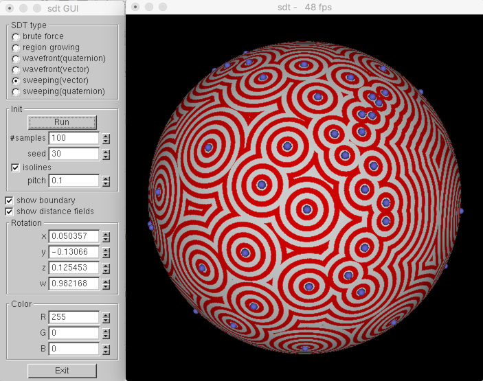

# sdt
An implementation of distance fields on a unit sphere

# Libraries that I use
   - OpenGL + glut
   - glui
   - vecmath package C++ port : http://objectclub.jp/download/vecmath_e 

# build 
We confirmed the codes can be built on CMake + Mac.

# Citation 
If you use this code for your research, I kindly ask you to cite the following publication. 

 - T. Michikawa and H. Suzuki,  "Spherical distance transforms", in Proceedings of International Conference on Computational Sciences and Its Applications 2008, Perugia, Italy, 2008, pp. 405–412, http://dx.doi.org/10.1109/ICCSA.2008.67

